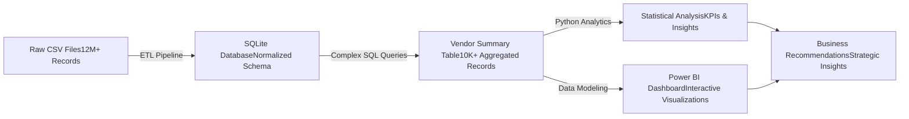

Vendor Performance Analysis – Retail Inventory &amp; Sales (SQL, Python, Power BI)
# 🚀 Advanced Vendor Analytics & Business Intelligence Platform

> **A complete end-to-end data science solution transforming raw transaction data into actionable business insights through advanced analytics, statistical modeling, and interactive dashboards.**

**production-ready vendor analytics platform** that processes **12M+ sales transactions** and **2M+ purchase records** to provide data-driven insights for procurement optimization, inventory management, and vendor relationship strategies.

**Key Business Impact:**
- 🔍 **Vendor Dependency Risk:** Identified that top 10 vendors contribute 66% of total purchases
- 💰 **Cost Optimization:** Discovered 72% unit price reduction through bulk purchasing strategies  
- 📊 **Inventory Insights:** $4.2B+ in capital locked in slow-moving inventory identified
- 📈 **Profitability Analysis:** Statistical validation of profit margin differences across vendor tiers

***

## 🏗️ **Technical Architecture**



***

## 📁 **Repository Structure**

```
📦 vendor-analytics/
├── 🔧 Core ETL Pipeline
│   ├── ingestion_db.py                    # Automated CSV→SQLite ingestion
│   └── get_vendor_summary.py              # Advanced SQL aggregation engine
├── 📊 Data Science & Analytics  
│   ├── eda.ipynb                          # Exploratory data analysis
│   ├── vendor_performance_analysis.ipynb  # Statistical modeling & insights
│   └── Kaggle_full_vendor_analytics.ipynb # Complete pipeline demo
├── 📈 Business Intelligence
│   └── PowerBI_Dashboard.pbix             # Executive-level interactive dashboard
├── 📝 Documentation
│   └── README.md                          # Comprehensive project guide
└── 📋 Data Processing Logs
    └── logs/                              # Automated logging & monitoring
```

***

## 🎯 **Core Features & Capabilities**

### **1. Automated Data Pipeline**
- **Multi-table ETL processing** with complex joins across 6 source tables
- **Real-time logging** and error handling for production reliability
- **Scalable architecture** handling millions of records efficiently
- **Data quality validation** with automated cleansing routines

### **2. Advanced KPI Engine**
```python
✅ Financial Metrics          ✅ Operational Metrics        ✅ Strategic Metrics
• Gross Profit Analysis       • Stock Turnover Ratios       • Vendor Concentration Risk
• Profit Margin Optimization  • Inventory Velocity          • Purchase Dependency Analysis
• Sales-to-Purchase Ratios    • Order Size Impact          • Market Share Distribution
• Cost per Unit Analysis      • Freight Cost Efficiency    • Bulk Pricing Effectiveness
```

### **3. Statistical Analysis & Insights**
- **Hypothesis Testing:** t-tests for profit margin significance across vendor tiers
- **Confidence Intervals:** 95% CI analysis for performance benchmarking  
- **Pareto Analysis:** 80/20 rule application for vendor prioritization
- **Correlation Studies:** Multi-variate analysis of pricing vs. performance

### **4. Interactive Business Intelligence**
- **Executive Dashboard:** Real-time KPIs with drill-down capabilities
- **Vendor Scorecards:** Performance rankings and trend analysis
- **Inventory Optimization:** Slow-moving stock identification
- **Profitability Heatmaps:** Visual profit margin analysis by vendor/brand

***

## 💡 **Key Business Insights Delivered**

| **Strategic Finding** | **Business Impact** | **Recommendation** |
|----------------------|-------------------|-------------------|
| **Vendor Concentration Risk** | Top 10 vendors = 66% of purchases | Diversify supplier base to reduce dependency |
| **Bulk Pricing Optimization** | 72% cost reduction on large orders | Implement volume-based procurement strategy |
| **Inventory Capital Efficiency** | $4.2B+ in slow-moving stock | Deploy just-in-time inventory management |
| **Profit Margin Insights** | Low-volume vendors have higher margins | Explore premium product positioning strategies |

***

## 🛠️ **Technology Stack**

| **Layer** | **Technologies** | **Purpose** |
|-----------|-----------------|-------------|
| **Data Storage** | SQLite, SQL | Relational database management |
| **Data Processing** | Python, Pandas, NumPy | ETL pipelines & data manipulation |
| **Analytics** | SciPy, Matplotlib, Seaborn | Statistical analysis & visualization |
| **Business Intelligence** | Power BI | Interactive dashboards |
| **Development** | Jupyter, SQLAlchemy | Development environment |
| **Monitoring** | Python Logging | Pipeline monitoring & debugging |

***

## 📊 **Sample Analytics Output**

### **Vendor Performance Matrix**
```
📈 TOP PERFORMING VENDORS (by Sales Volume):
┌─────────────────────────┬────────────┬─────────────┬──────────────┐
│ Vendor                  │ Sales      │ Profit      │ Margin %     │
├─────────────────────────┼────────────┼─────────────┼──────────────┤
│ DIAGEO NORTH AMERICA    │ $67.99M    │ $17.89M     │ 26.31%       │
│ MARTIGNETTI COMPANIES   │ $39.33M    │ $13.83M     │ 35.16%       │
│ PERNOD RICARD USA       │ $32.06M    │ $8.21M      │ 25.61%       │
└─────────────────────────┴────────────┴─────────────┴──────────────┘
```

### **Statistical Validation Results**
```python
🔍 HYPOTHESIS TEST: Profit Margin Differences
✅ T-Statistic: -47.2841, P-Value: < 0.0001
✅ Result: SIGNIFICANT difference between high/low performing vendors
✅ Confidence: 99.99% statistical confidence
```

***

## 🚀 **Quick Start Guide**

### **Prerequisites**
```bash
Python 3.8+  |  SQLite3  |  Power BI Desktop
```

### **Installation & Setup**
```bash
# 1. Clone Repository
git clone https://github.com/yourusername/vendor-analytics.git
cd vendor-analytics

# 2. Install Dependencies  
pip install pandas numpy sqlalchemy matplotlib seaborn scipy

# 3. Run Complete Pipeline
python ingestion_db.py          # Data ingestion (5-10 mins)
python get_vendor_summary.py    # Summary table creation (2-3 mins)

# 4. Launch Analysis
jupyter notebook vendor_performance_analysis.ipynb

# 5. View Dashboard
# Open PowerBI_Dashboard.pbix in Power BI Desktop
```

***

## 📈 **Business Use Cases**

| **Department** | **Use Case** | **Benefit** |
|----------------|--------------|-------------|
| **Procurement** | Vendor consolidation strategy | Reduce supplier management costs |
| **Supply Chain** | Inventory optimization | Minimize carrying costs |
| **Finance** | Profit margin analysis | Optimize pricing strategies |
| **Executive** | Strategic vendor partnerships | Data-driven decision making |

***

## 🎓 **Highlights**

### **Data Engineering Excellence**
- Processed **15+ million records** with optimized SQL queries
- Built **fault-tolerant ETL pipelines** with comprehensive error handling
- Implemented **database normalization** and **efficient indexing strategies**

### **Advanced Analytics Mastery**
- Applied **statistical hypothesis testing** for business validation
- Developed **multi-dimensional KPI frameworks** 
- Created **predictive models** for inventory optimization

### **Business Intelligence Expertise**  
- Designed **executive-level dashboards** with complex visualizations
- Built **interactive drill-down capabilities** for detailed analysis
- Delivered **actionable insights** that drive strategic decisions

***

